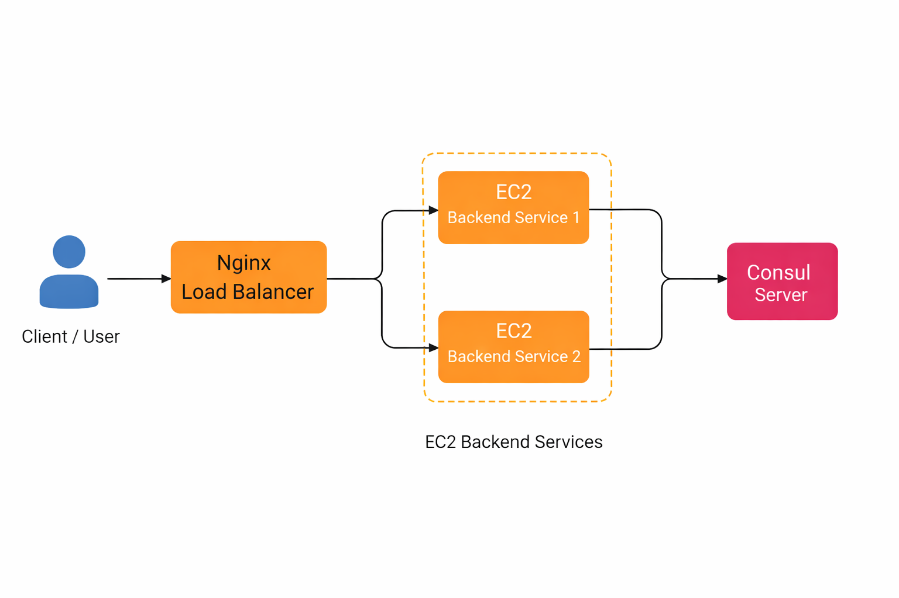
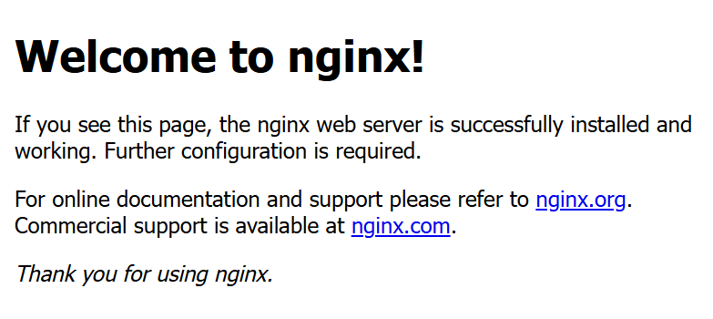
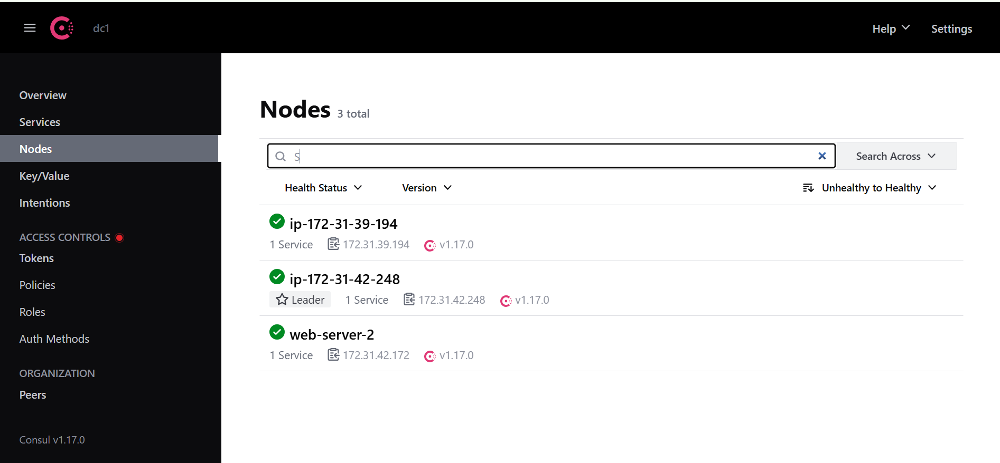

# Consul-service-discovery-project
Service discovery architecture on AWS using Consul, Consul Template, and Nginx to dynamically register backend services and load balance traffic across EC2 instances.
---

## Project Overview

This project demonstrates how service discovery works in a distributed system using Consul.

In systems with multiple backend services running across different servers, managing service addresses manually becomes difficult. Consul solves this problem by acting as a service registry where services can dynamically register themselves and be discovered by other services.

In this setup, backend services run on EC2 instances behind an Nginx load balancer. Consul keeps track of all service nodes and allows services to communicate without relying on hardcoded IP addresses.

---

## Architecture Diagram

The following diagram shows the overall architecture of the system.

---

## Technologies Used

- Consul – Service discovery and service registry  
- Consul Template – Dynamic configuration updates  
- Nginx – Load balancing between servers  
- AWS EC2 – Hosting the infrastructure  
- Linux / Ubuntu  

---

## Implementation Steps

1. Created multiple EC2 instances to simulate a distributed system.
2. Installed and configured Consul on the servers.
3. Registered backend services with the Consul server.
4. Used Consul Template to dynamically update service configuration.
5. Configured Nginx as a load balancer.
6. Verified service registration and nodes using the Consul UI.

---

## Screenshots

### Consul Implementation

### EC2 Instances

### Nginx Configuration – Server 1

### Nginx Configuration – Server 2

### Consul Nodes

### Backend Services

---

## Learnings

Through this project, I gained hands-on understanding of:

- How service discovery works in distributed systems
- The role of Consul as a service registry
- How load balancers distribute traffic across multiple servers
- How services can dynamically discover each other without hardcoded endpoints

 ## Future Improvements

Some possible improvements for this project include:

- Automating infrastructure provisioning using Terraform
- Automating configuration using Ansible
